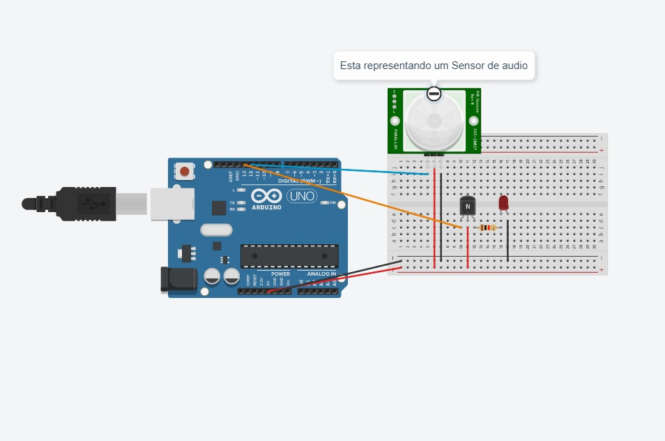

# Microfone_conta_batidas

Estudo de controle de arduino, onde o arduino aciona comandos por quantidade de batidas, tanto comandos enviados via porta serial quanto comandos direcionados ao propio hardware

